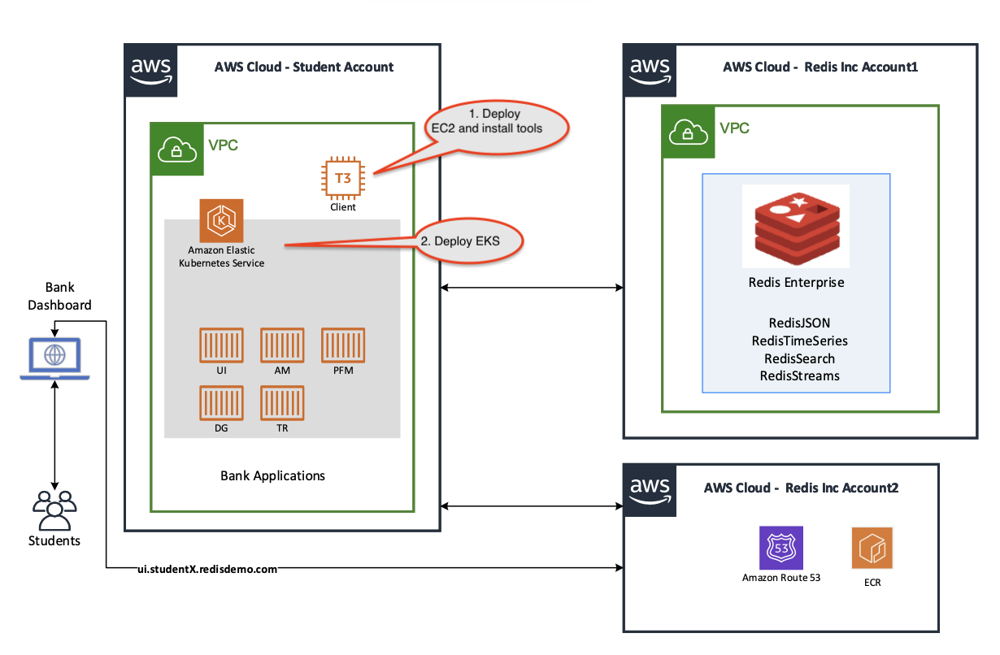
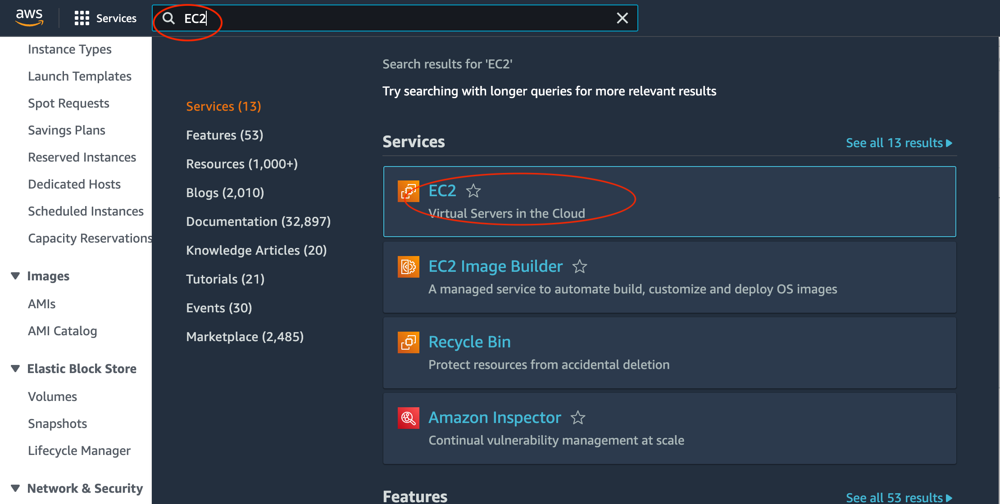
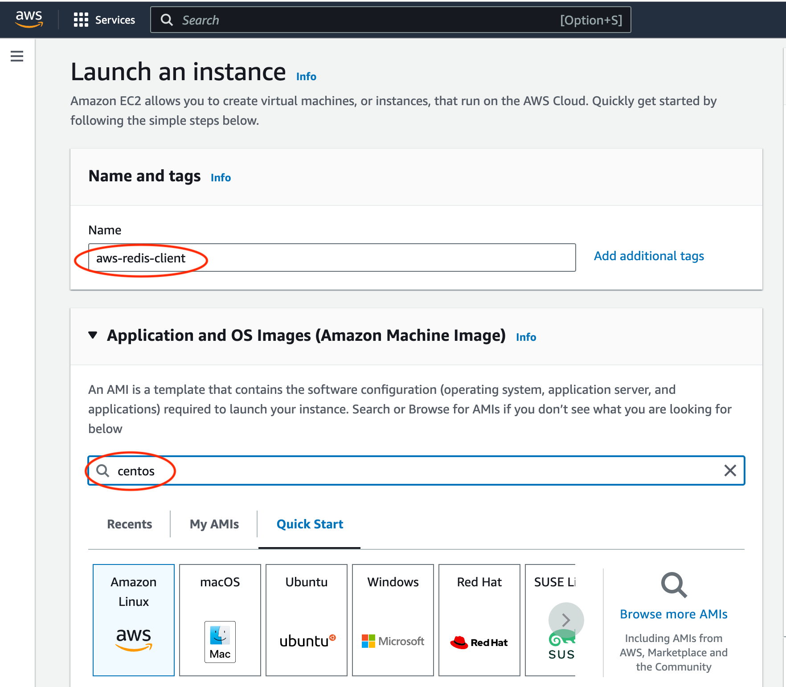
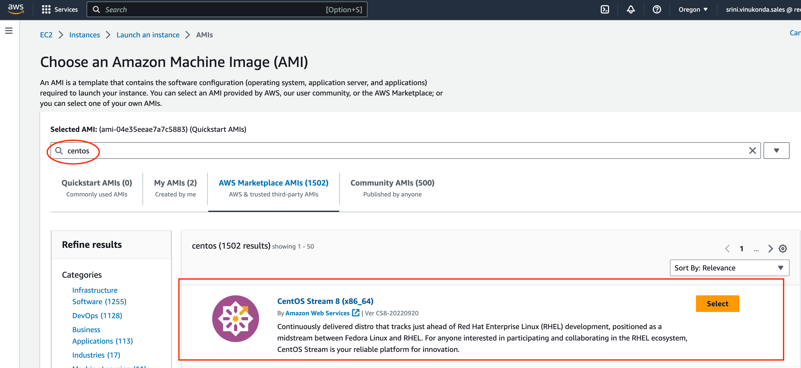
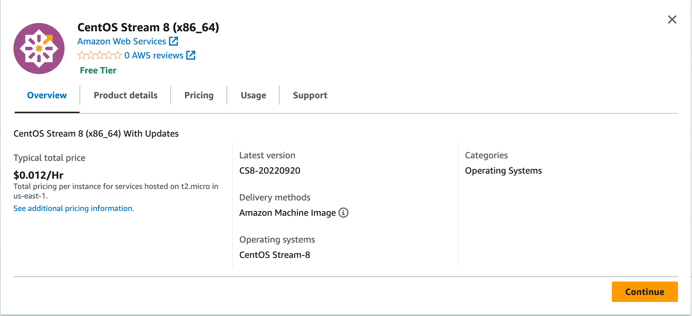
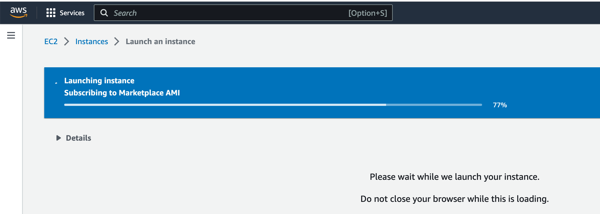
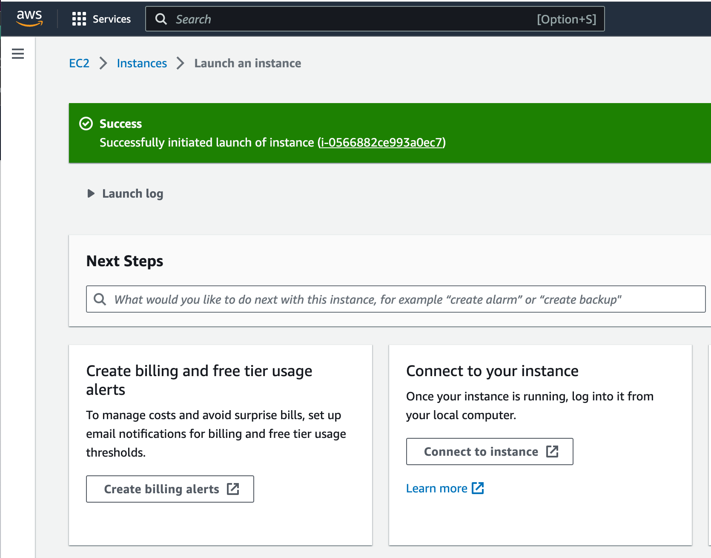

# Lab 01 - EKS deployment from EC2

Duration: 30 mins

## Goals:
- Deploy an EC2 instance (our client machine) and install various necessary utilities to complete our lab
- Set credentials and configuration used aws configure 
- Install K8s related tools like kubectl, Helm, eksctl
- Launch EKS cluster

In this lab we will launch an EC2 instance and install all the necessary utilities.Then we will deploy EKS cluster. 
If you are the root user or an IAM user with "Admin Access" then you should be all set with all the permissions needed to run the labs.

  


## Prepare environment

1. Lets start with creating an EC2 machine that will be used as client machine.



2. Navigate yourself to EC2 dashboard


3. Launch an instance. Give it a name and search for Centos AMIs. Type "centos" and hit enter. Then click on "AWS Marketplace AMIs".




4. In the search results select CentOS 8 for x86_64 architecture, as shown.



5. Continue further



6. Choose instance type as "t2-medium"


7. Create a new key pair.


8. Give it a name, key pair type and file format, as shown.


9. As soon as you exit out of this screen, the `.pem` file will be downloaded to your local machine.


10. Create a `Security Group` and allow `SSH Traffic` from `My IP`


11. Configure storage as shown


12. Launch Instance





13. Get the Public DNS/IP details to access it via SSH terminal from your local machine.


14. Open a Terminal Window and secure your `.pem` file, to be used with your SSH sessions

```
mv ~/Downloads/aws-redis.pem ~/.ssh/
chmod 400 ~/.ssh/aws-redis.pem
```

15. Invoke SSH session using `ssh` command. Here is an example for a typical public IP address of an ec2 machine. Replace `ec2-server-hostname` with actual hostname. Make sure to use centos@<hostname> and not ec2user@<hostname> like the AWS webconsole suggests.
```
ssh -i "~/.ssh/aws-redis.pem" centos@<ec2-server-hostname>
```
An example:
```
ssh -i "~/.ssh/aws-redis.pem" centos@ec2-35-93-64-166.us-west-2.compute.amazonaws.com
```


16. Lets go ahead and install a few pre-requisite packages. We will start with generic utilities.
```
sudo yum install -y yum-utils
```
```
sudo yum-config-manager \
    --add-repo \
    https://download.docker.com/linux/centos/docker-ce.repo
```
17. Install Docker and Docker Compose.

```
sudo yum install -y docker-ce docker-ce-cli containerd.io docker-compose-plugin
```
```
sudo systemctl start docker
```

```
sudo curl -L "https://github.com/docker/compose/releases/download/v2.1.1/docker-compose-$(uname -s)-$(uname -m)" -o /usr/local/bin/docker-compose
```
```
sudo chmod +x /usr/local/bin/docker-compose
```

```
sudo groupadd docker
sudo usermod -aG docker ${USER}
```

The `exit` command will exit you out of SSH session. This is done to re-login again.

```
exit
```

Re-login using SSH command you already used. Here is an example:
```
ssh -i "~/.ssh/aws-redis.pem" centos@ec2-35-93-64-166.us-west-2.compute.amazonaws.com
```
Once you logged in, start Docker service.

```
sudo systemctl start docker
```

18. Install Git, wget, unzip

```
sudo yum install git -y
sudo yum install wget -y
sudo yum install unzip -y

```

19. Lets install AWS CLI.
```
curl "https://awscli.amazonaws.com/awscli-exe-linux-x86_64.zip" -o "awscliv2.zip"
unzip awscliv2.zip
sudo ./aws/install
aws --version
```

20. Lets configure your AWS CLI.
```
aws configure
```
This tool will prompt you to enter the following information, to configure your CLI:
- `AWS Access Key ID [None]:`
- `AWS Secret Access Key [None]`
- `Default region name [None]:`
- `Default output format [None]:`

You can get your `AWS Access Key ID` and `AWS Secret Access Key` from the AWS Webconsole.

Go to `IAM` ==> `Security Credentials`


Go to `Access keys` section and create one.


We are not building a Production system. Ignore this warning by click on `I understand...` and move forward by clicking on `Create access key`


Once the access key is created, take a note of them from this screen. You will need it to configure your AWS CLI.


Now feed this information to your `aws configure` tool. Here is a typical example:

> NOTE: Do not execute the following snippet. Its just an example of a typical output.
```
[centos@ip-172-31-9-71 lamdba]$ aws configure
AWS Access Key ID [None]: AKIXXXXXXXXXXFGF
AWS Secret Access Key [None]: 3+QxxxxxxxxXXXXXXXXXxxxxxxXXXXXMvY
Default region name [None]: us-west-2
Default output format [None]:
```

## Install eksctl 

1.  Lets install eksctl. Additional details can be found from [here](https://github.com/eksctl-io/eksctl/blob/main/README.md#installation).

```
# for ARM systems, set ARCH to: `arm64`, `armv6` or `armv7`
ARCH=amd64
PLATFORM=$(uname -s)_$ARCH

curl -sLO "https://github.com/eksctl-io/eksctl/releases/latest/download/eksctl_$PLATFORM.tar.gz"

# (Optional) Verify checksum
curl -sL "https://github.com/eksctl-io/eksctl/releases/latest/download/eksctl_checksums.txt" | grep $PLATFORM | sha256sum --check

tar -xzf eksctl_$PLATFORM.tar.gz -C /tmp && rm eksctl_$PLATFORM.tar.gz

sudo mv /tmp/eksctl /usr/local/bin
```

## Install helm

1. Install Helm. This is neeed for installing AWS Ingress controller.
```
curl -fsSL -o get_helm.sh https://raw.githubusercontent.com/helm/helm/main/scripts/get-helm-3
chmod 700 get_helm.sh
./get_helm.sh

helm version
```

## Install kubectl 

1.  Install kubectl. We will install 1.25 version for this lab. Verify the downloaded binary with the SHA-256 checksum for your binary. Additional details related to K8s releases can be found from [here](https://kubernetes.io/releases/). There are newer versions 1.26, 1.27 available now.

```
curl -O https://s3.us-west-2.amazonaws.com/amazon-eks/1.25.9/2023-05-11/bin/linux/amd64/kubectl
```

2. Verify the downloaded binary with the SHA-256 checksum for your binary. Download the SHA-256 checksum for your cluster's Kubernetes version from Amazon S3.

```
curl -O https://s3.us-west-2.amazonaws.com/amazon-eks/1.25.9/2023-05-11/bin/linux/amd64/kubectl.sha256
```
3. Check the SHA-256 checksum for your downloaded binary with one of the following commands. The output should be "kubectl: OK"
```
sha256sum -c kubectl.sha256
```
4. Apply execute permissions to the binary. Copy the binary to a folder in your PATH. Validate by running the version command 

```
chmod +x ./kubectl

mkdir -p $HOME/bin && cp ./kubectl $HOME/bin/kubectl && export PATH=$HOME/bin:$PATH

kubectl version --short --client

```

## Deploy EKS cluster 

Now we are ready to deploy our EKS cluster. Give the cluster name based on your student number like student1, student2..

```
eksctl create cluster student<your number>
```

If the student is root or IAM user with "Admin Access" then the cluster will be created in about 15 to 20 minutes. We will go back to slides to cover AWS services and work on this EKS cluster once fully deployed.

In this lab we deployed an EC2 instance, installed all the necessary utilites, and started the deployment of an EKS cluster.

See you in the next lab.  [Go back](..)
