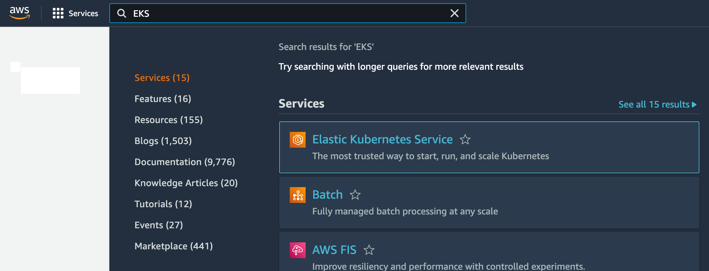
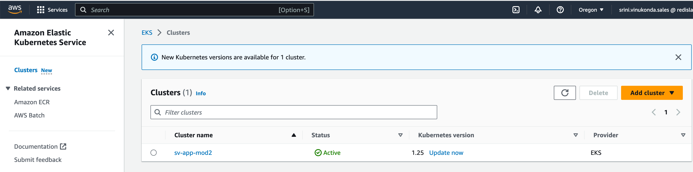
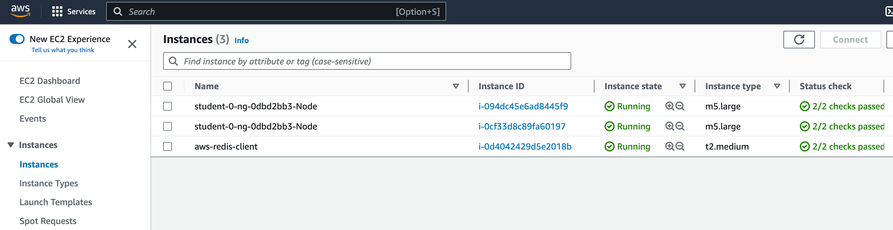
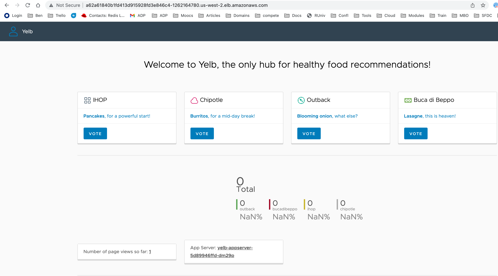
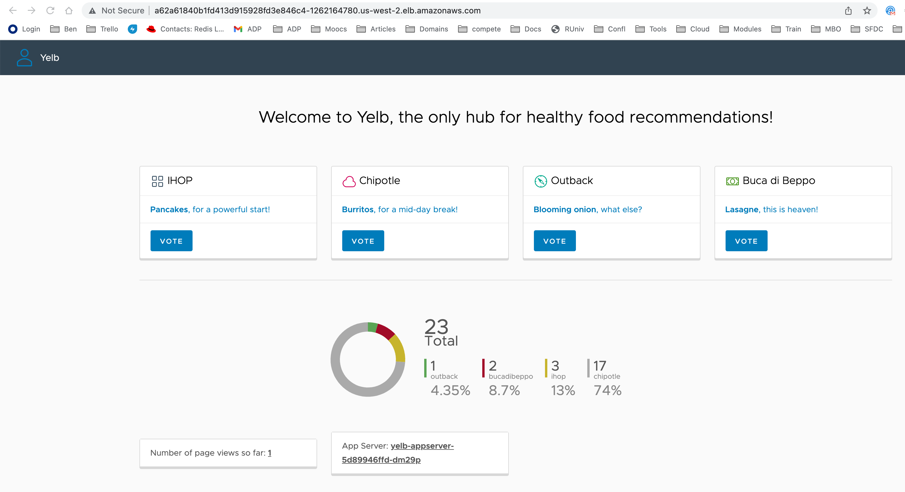

# Lab 02 - Sample App in EKS

Duration: 15 mins

## Goals:
- Understanding k8s cluster context
- Connecting to the right cluster
- Create namespaces 
- Deploy sample app
- Review various k8s resources like deployments, pods, and services

In this lab we will connect to the EKS cluster we deployed in the previous lab. We will then deploy a sample app called "yelb". After reviewing the app, we will delete the sample app.


# Connect to EKS cluster

1. List the clusters. You can also go to web console, type EKS, and look at your cluster.

```
eksctl get cluster
```
You will see a response like this.

```
[centos@ip-172-31-0-92 ~]$ eksctl get cluster
NAME		REGION		EKSCTL CREATED
student-0	us-west-2	True
```




2. Find out the current cluster context. You will see "*" under "CURRENT" which will be your current context. If there are many clusters and you need to switch the you can use use the command "kubectl config set-context <NAME>". After running this command "*" will appear on this cluster mentioned.

```
kubectl config get-contexts
```
```
[centos@ip-172-31-0-92 ~]$ k config get-contexts
CURRENT   NAME                                                  CLUSTER                         AUTHINFO                                              NAMESPACE
*         srini.vinukonda.sales@student-0.us-west-2.eksctl.io   student-0.us-west-2.eksctl.io   srini.vinukonda.sales@student-0.us-west-2.eksctl.io
```

3. What are the worker nodes of this cluster? You can also go to the AWS web console and see these running instances under EC2 sectio. 

```
kubectl get nodes
```

```
[centos@ip-172-31-0-92 ~]$ k get nodes
NAME                                           STATUS   ROLES    AGE   VERSION
ip-192-168-43-127.us-west-2.compute.internal   Ready    <none>   44m   v1.25.11-eks-a5565ad
ip-192-168-66-250.us-west-2.compute.internal   Ready    <none>   44m   v1.25.11-eks-a5565ad
```



4. Now we will deploy a sample application. For this we will create a namespace first.

```
kubectl create ns yelb
```

5.  Deploy the application using below command. This will deploy
    - ui deployment
    - appserver deployment
    - redis-server deployment
    - db deployment

```
kubectl apply -f https://raw.githubusercontent.com/lamw/vmware-k8s-app-demo/master/yelb-lb.yaml
```

List the resources created.
```
kubectl -n yelb get deployment,pods,service
```
Short version of the above command is 
```
kubectl -n yelb get deploy,po,svc
```

6. Validate the deployment by copying the ELB and pasting it on your browser. Please wait for a minute or two for the ELB to be fully active. You will see the ui page like below.





7. Go ahead and click on "VOTE" buttons for different restuarants. You will see the data and the chart updating in real time.



8. Now that we know how to connect to EKS cluster and deploy a sample app, we can delete this app.

```
kubectl delete ns yelb

kubectl -n yelb get deploy,po,svc

```

In this lab, we successfully connected to our EKS cluster, deployed a sample app, and validated the app.

When ready continue to the next lab  [Lab 3 - Deploy Cloud Native Application](Lab%203%20-%20Deploy%20Cloud%20Native%20App)
